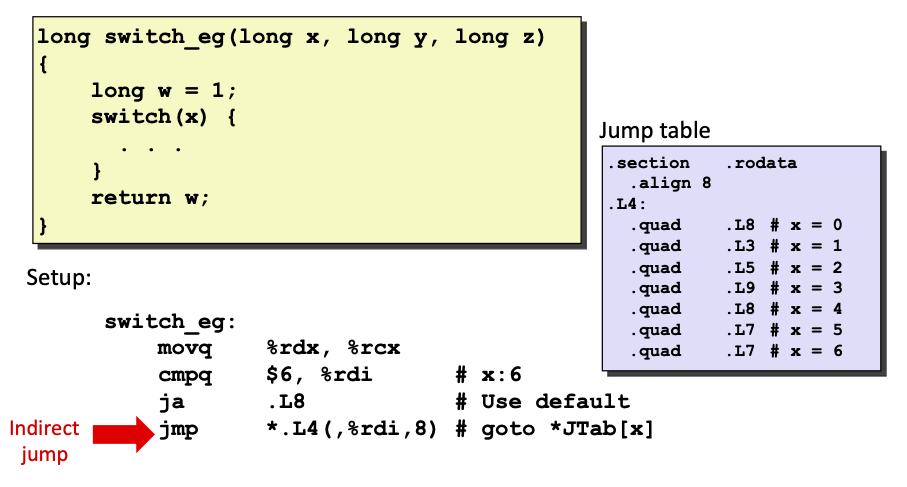

# Introduction to Computer Systems

Textbook: [Computer Systems: A Programmer's Perspective, Third Edition](http://csapp.cs.cmu.edu), and David suggests that a really good strategy for studying and preparing for this course would be to read each chapter *three times*.

Class web page: [http://www.cs.cmu.edu/~213](http://www.cs.cmu.edu/~213)

I want to note all the thing when I take the classes, but I couldn't. So I just note something I think that's very interesting or very important. And I will enrich them when I read the textbook. And, I really recommend you all to take the classes!

## Lecture 1: Course Overviewn

> Create Time: 2023.07.11  Update Time: 2023.07.11

### Course Theme

Abstraction is good but don't forget reality. Coding is that you just put some text into a box, and the purpose of this course is to give you enough understanding of what the box is doing when it executes your code, and through that to help you become better at what you're trying to do.

#### Great Reality #1

Ints are not integers, and floats are not reals.

```lldb
(lldb) print 40000 * 40000
(int) $0 = 1600000000
(lldb) print 50000 * 50000
(int) $1 = -1794967296
(lldb) print 300 * 400 * 500
(int) $2 = 60000000
(lldb) print 300 * 400 * 500 * 600
(int) $3 = 1640261632
(lldb) print (1e20 + -1e20) + 3.14
(double) $4 = 3.1400000000000001
(lldb) print 1e20 + (-1e20 + 3.14)
(double) $5 = 0
```

#### Great Reality #2

You've got to know assembly

As Randal says, you'll never write programs in assembly, because compilers are much better and more patient than you are, but, **understanding assembly** is key to machine-level execution model. And this courses looks at the language of Intel 64-bit processors.

#### Great Reality #3

Memory Matters.

Random access memory is an unphysical abstraction, and memory is not unbounded.

C and C++ do not provide any memory protection. It is a particular feature of these languages. :)

```C
typedef struct
{
    int a[2];
    double d;
} struct_t;

double fun(int i)
{
    volatile struct_t s;
    s.d = 3.14
    s.a[i] = 1073741824; /* Possibly out of bounds */
    return s.d;
}
```

When you execute this code and set `i` from 0 to 6, you can get something interesting.

#### Great Reality #4

There's more to performance than asymptotic complexity.

You need to understand what the system does, what makes it run well and what makes it run poorly.

```C
void copyij(int src[2048][2048], int dst[2048][2048])
{
    int i, j;
	for (i = 0; i < 2048; i++)
	    for (j = 0; j < 2048; j++)
		    dst[i][j] = src[i][j]
}
```

```C
void copyij(int src[2048][2048], int dst[2048][2048])
{
    int i, j;
	for (j = 0; j < 2048; j++)
	    for (i = 0; i < 2048; i++)
		    dst[i][j] = src[i][j]
}
```

What you'll find if you run these two codes on a typical system is that the first one is much faster than the second one.

#### Great Reality #5

Computers do more than execute programs.

They need to get data in and out, and they communicate with each other over networks.

### Course Perspective

A programmer's perspective, and it means let you, as a person who sits in front of a computer screen typeing code, know about the machine you're typing code for in order to be effective at doing it, as spposed to somebody who some day goes to be designing and building the actual machine itself.

## Lecture 2: Bits, Bytes and Integers 1

>  Create Time: 2023.07.12  Update Time: 2023.07.13

> I'll going to pass through the part of base 2 number representatoin.

### Bits and Bytes

- Everything is bits, and each bit is 0 or 1. This is because of the electronic implementation.
- We usually group collections of 4bits at a time and then represent that in base 16 which is known as hexademical representatoin.
- And a byte means 8 bits.
- When they say it's a 64-bit machine, what they really mean is that the addresses are 64-bit values or 8-byte values.

#### Boolean algebra

- `A&B = 1` when both A=1 and B=1
- `A|B = 1` when either A=1 and B=1
- `~A = 1` when A=0
- `A^B=1` when either A=1 or B=1, but not both

#### Shift operations

- Left shift `x << y`: shift bit-vector x left y positions
  - Throw away extra bits on left
  - Fill with 0's on right
- Right shift `x >> y`: shift bit-vector x right y positions
  - Throw away extra bits on right
  - Logical shift: fill with 0's on left
  - Arithmetic shift: replicate most significant bit on left
- Undefined behavior
  - shift amount < 0 or >= word size
	- On most machine, you'll get whatever x is.

### Numer Representation

#### Encoding integers

Here's one interesting idea about how to compute signed number with two's complement. When I took my C programming course in my freshman year, I got when I got a bit pattern, such as `1010`, and the sign bit is `1`, so I needed to ignore the sign bit, and bitwise negated the number, then I got `101` which ignored the sign bit, and it means 5 based 10, finally, I could increment on 5 and add the negative sign and I got the correct number `-6`. But, here, Randal tells, **for signed number, the sign bit is negative. Only this thing, and there's no other differences between unsigned numbers and signed number.** For bit pattern `1010`, you can use $1\times2^3+0\times2^2+1\times2^1+0\times2^0=10$ for unsigned number, and $1\times(-2^3)+0\times2^2+1\times2^1+0\times2^0=-6$. You can find that my old method is equivalent to this one, but the latter is so exquisite!

#### Ranges of a bit pattern with w bits

- Unsigned values: $UMin=0(00..00)$ and $UMax=2^w-1(11..11)$
- Two's complement values: $TMin=-2^{w-1}(100..00)$ and $TMax=2^{w-1}-1(011..11)$

##### Observation

- $|TMax|=|TMin|-1$
- $|UMax|=2\times|TMax|+1$

#### Mapping between signed & unsigned

You can find the mapping rule easily: when the highest bit is 0, they represent the same number, and when the highest bit is 1, their difference is $2^w$. And the mapping is unique.

#### Signed & unsigned in C

- Constants by default are considered to be signed integers.
- If there is a mix of unsigned and signed in single expression, *signed values implicitly cast to unsigned*.

### Expanding and Truncating

#### Sign extension

Given $w$-bit signed integer $x$, and now you want to convert it to $w+k$-bit integer with same value. You should just make $k$ copies of the sign bit.

#### Expanding

- Unsigned: zeros added
- Signed: sign extension

#### Truncating

- Unsigned/Signed: bits are truncated
- Result reinterpreted:
  - Unsigned: mod operation
  - Signed: similar to mod operation

## Lecture 3: Bits, Bytes and Integers 2

>  Create Time: 2023.07.14  Update Time: 2023.07.15

### Arithmetic Operations

#### Addition and Subtraction

Add the two $w$-bit numbers and just truncate $w$ bits if need. You can try to understand it by something mod operation. And you can just do subtraction by doing addition with a negative number in two's complement. So **the additions in unsigned and two's complement have identical bit-level behavior**, which is the reason two's complement is the most popular pattern for signed numbers.

You need to notice the **overflow**, which happens when the true result is $w+1$ bits and trucated.

#### Multiplication

As the same as addition, you just truncate $w$ bits if you need. And so does the overflow.

#### Power-of-2 Multiply and Divide with Shift

- $u << k$ gives $u * 2^k$

- $u >> k$ gives $\lfloor u / 2^k \rfloor$
  - For signed number, use arithmetic shift. In C there's no fixed requirement for the type of shift, but on most machines, it will be arithmetic shift.

#### Negate

Standard way: complement and increment. (The way my teacher teached, but I think core of the two's complement should not be this. This is just a way to compute the nagative number.)

### Byte-Oriented Memory Organization

In your mind, **the memory is just a big array of bytes** which is numbered from 0 up to some maximum number. In fact what happens is that the operation system only allows certain regions within that memory to be referenced, and if you try to access the other regions it will signal an error what they call *segmentation fault*.

#### Machine Words

There's no really fixed idea of what a word size is. But roughly speaking, the word size is the nominal size of integer-valued data and of addresses. When we talk about a 64-bit machine, what we mean is that it regularly and routinely manipulate 64-bit values and arithmetic operations and it has a pointers or the values of addresses are 64-bit. *Actually, the word size of a program is determined by the combination of the hardware and the compiler.*

#### Addresses

We group the memory into blocks of words, and we usually assume that the address of the word is the lowest value address in it.

#### Byte Ordering

How are the bytes within a multi-byte word ordered in memory? There's little endian and big endian. For little endian, the first byte in the word is the least significant byte and big endian does the opposite.

- Big Endian: Sun, PPC Mac, Internet
- Little Endian: x86, ARM processors running Android, iOS and Windows

You can code to print byte representation of data:

```C
typedef unsigned char *pointer;

void show_bytes(pointer start, size_t len)
{
    size_t i;
    for(i = 0; i < len; i++)
        printf("%p\t0x%.2x\n", start+i, start[i]);
    printf("\n");
    return;
}
```

#### Representing Strings

Different with numbers, byte ordering of strings in C is not an issue. This is because strings is represented by array of characters in C. But there're some tricky things for strings in C: each character encoded in ASCII format and string should be null-terminated.

### Integers C puzzles

> I recommend you try to figure them out following the class which can help you determine how well you're learning.

Why `x & (x-1) != 0`?

### Extented Reading

- [A weird question for Tmax(0x7fffffff), why (!x) == x?](https://stackoverflow.com/questions/62534011/a-weird-question-for-tmax0x7fffffff-why-x-x)

- [Why is unsigned integer overflow defined behavior but signed integer overflow isn't?](https://stackoverflow.com/questions/18195715/why-is-unsigned-integer-overflow-defined-behavior-but-signed-integer-overflow-is)


## Lecture 4: Floating Point

> Create Time: 2023.07.16  Update Time: 2023.07.16

For fractional binary number representation, it's no different for bit pattern representation for integer numbers. But there's some limitation:

- It can only exactly represent numbers of the form $x/2^k$, because other rational numbers have repeating bit representations
- Just one setting of binary point within the $w$ bits, which means you must do some trade-off between number range and number precision. This is where the *floating* comes.

### Floating Point Representation (IEEE standard)

- Numerical Form: $(-1)^s * M * 2^E$
  - Sign bit $s$ determines whether number is negative or positive
  - Significand $M$ normally a fractional value in range [1.0, 2.0].
  - Exponent $E$ weights value by power of two.
- Encoding: `s` + `exp` + `frac`
  - MSB(most significant bit) S is sign bit $s$
  - exp field encodes $E$ but is not equal to $E$
  - frac field encodes $M$ but is not equal to $M$
- Precision options
  - Single precision(32 bits): `s`(1 bit) + `exp`(8 bits) + `frac`(23 bits)
  - Double precision(64 bits): `s`(1 bit) + `exp`(11 bits) + `frac`(52 bits)
  - Extended precision(80 bits, Intel only, not-standard): `s`(1 bit) + `exp`(15 bits) + `frac`(63 or 64 bits)

#### Types

- Normalized values
  - `exp` != 00..00 and `exp` != 11..11
  - Exponent coded as a biased value: `E` = `Exp` - `Bias`
    - `Exp` is the unsigned value of `exp` field
    - `Bias` = $2^{k-1} - 1$, where $k$ is number of exponent bits
  - Significand coded with implied leading 1: `M` = 1.xx..xx
    - xx..xx: bits of `frac` field
    - minimum when `frac`=00..00
    - maximum when `frac`=11..11

- Denormalized values (for some so small numbers closed to zero)
  - `exp` = 00..00
  - Exponent value: `E` = 1 - `Bias` instead of `E` = 0 - `Bias`
  - Significand coded with implied leading 0: `M` = 0.xx..xx
- Special values
  - `exp` = 11..11
  - `frac` = 00..00: representing infinity which comes when operations overflow.
  - `frac` != 00..00: representing Not-a-Number(NaN) which comes when no numeric value can be determined.

#### Visualization and Example

Here's the visualization of the floating number ranges and types.


Here's an example with `s`(1 bit) + `exp`(4 bits) + `frac`(3 bits).


#### Distribution

You can find the distribution gets denser toward zero, like this:


You can find that, when exp field increments, the spacing between two numbers will double. This is the reason the distribution gets denser toward zero.

And at the same time, you can find the spacings of denormalized numbers and the set of the smallest normalized numbers are the same. This can be explained by the rules of denormalized number and normalized number. This is also a manifest for the nice smooth transition.

#### Operations

##### Basic idea

- First compute exact result
- Make it fit into desired precision
  - Possibly overflow if exponent too large
  - Possibly round to fit into `frac`

##### Rounding

- Towards zero
- Round down (towards negative infinity)
- Round up (towards positive infinity)
- **Nearest even (default)**

##### Multiplication

$(-1)^s * M * 2^E = (-1)^{s_1} * M_1 * 2^{E_1} \times (-1)^{s_2} * M_2 * 2^{E-2}$

- $s = s_1 + s_2 = s_1 \oplus s_2$
- $M = M_1 \times M_2$
- $E = E_1 + E_2$

You need fixing:

- If $M \geq 2$, by shifting $M$ right and incrementing $E$
- If $E$ out of range, overflow to infinity.
- Round M to fit `frac` precision.

Compared to Commutative Ring, Floating Point multiplication is not associative and not distributed over addition.

##### Addition

You need to align the binary points by shifting before adding. Actually, the smaller `exp` is aligned to the bigger one. There may be overflow if the difference between two `exp`s is too big.

Compared to Abelian Group, Floating Point addition is not associative because of overflow.

#### Casting in C

- From double/float to int:
  - Just truncating fractional part
  - Like rounding toward zero
  - Not defined when out of range or NaN: generally sets to TMin
- From int to double:
  - Exact conversion, as long as the word size (normally 32) is less than 53 (the size of frac field of double floating point)
- From int to float
  - Will round according to rounding mode.

## Lecture 5: Machine-Level Programming I: Basics

> Create Time: 2023.07.27  Update Time: 2023.07.28

> Pass the stories of Intel, x86, IA64, CISC, RISC, and ARM in my note, but it's also interesting to listen.

### C, assembly, machine code

#### Definitions

- Architecture (also ISA, Instruction Set Architecture): the parts of a processor design that one needs to understand or write assembly/machine code.
- Microarchitecture: Implementation of the architecture.
- Machine Code: the byte-level programs that a processor executes.
- Assembly Code: A text representation of machine code.

#### Machine/Assembly Code View

- PC: Program counter, actually address of next instruction, which is called "RIP" (`%rip`) for x86-64.
- Register file: heavily used program data
- Condition code: store status information about most recent arithmetic or logical operation for conditional branching.
- Memory: Byte addressable array for code and user data.
- NO cache from Code View, there's no instruction for cache. It's not visible to programmer.

#### Turning C into object code

Command: `gcc –Og p1.c p2.c -o p`, where `-O` means optimization, `g` means for debug (more readable), `-o` means output file.

After *preprocessing*, which is something simple like string replacement, there's still three steps to turn C into object code:

- Compile: from C programs to asm programs
- Assemble: from asm programs to object programs
- Link: from object programs and static libraries to executable program.

There's some dynamic libraries, which is linked when executing the program.


##### Compiling to Assembly

Command: `gcc –Og -S sum.c`, where `-S` means stop after this step (compiling to assembly)

##### Assembly Characteristics

> I'm not clear about this part, and I'll update when I totally understand them.

- Data Types
- Operations

##### Disassembling Object Code

Command: `objdump -d executable_file`

### Assembly Basics: Registers, operands, move

#### Registers


As this image shows, there's a special register, `%rsp`, which is stack pointer.

#### Moving Data

Command: `move source, dest`

Operand Types: Immediate (Constant integer data, e.g., `$0x400`), Register (one of 16 integer registers, e.g., `%rax`) and Memory (8 consecutive bytes of memory at address given by register, e.g., `(%rax)`).

Operand Combinations: `movq Imm, Reg`, `movq Imm, Mem`, `movq Reg, Reg`, `movq Reg Mem`, `move Mem Reg`. An Immediate is no meaning for a dest, and we can not do memory-memory transfer with a single instruction.

#### Single Memory Addressing Mode

- Normal: `(R)` is standing for `Mem[Reg[R]]`.
- Displacement: `D(R)` is standing for `Mem[Reg[R] + D]`.

#### Complete Memory Addressing Mode

- Most Genral Form: `D(Rb, Ri, S)` is standing for `Mem[Reg[Rb] + S * Reg[Ri] + D]`
  - D: Constant "displacement" 1, 2, or 4 bytes, omitting when D is 0.
  - Rb: Base register, any of 16 integer registers.
  - Ri: Index register, any of left 15 integer rigisters except for `%rsp`.
  - S: Scale, 1, 2, 4, or 8, omitting when S is 1.

### Arithmetic & logical operations

#### Address Computation Instruction

Command: `leaq source, dest`, where `source` is address mode expression, and `dest` is set to address denoted by expression.

#### Some Arithmetic Operations

##### Two Operand Instructions


##### One Operand Instructions


## Lecture 6: Machine-Level Programming II: Control

> Create Time: 2023.07.28  Update Time: 2023.08.01


### Condition codes

They are some signle bit registers.

- CF: Carry flag for unsigned, 1 if result carries out from the most significant bit (unsigned overflow).
- ZF: Zero flag, 1 if the result is 0.
- SF: Sign flag for signed, 1 if result is less than 0 as signed.
- OF: Overflow flag for signed, if signed overflow (including positive overflow and negative overflow).

#### Implicitly set

- Arithmetic operations: It's something like side effect.
- Compare: `cmpq src2, src1`, like computing `src1 - src2`
- Test: `testq src2, src1`, like computing `src1 & src2`, and it's useful when `src1` and `src2` are the same.

#### Explicitly set

**SetX intructions**: set low-order byte of destination to 0 or 1 based on combinations of condition codes.

| setX    | Condition         | Description               |
| ------- | ----------------- | ------------------------- |
| `sete`  | ZF                | Equal/Zero                |
| `setne` | ~ZF               | Not Equal/Not Zero        |
| `sets`  | SF                | Negative                  |
| `setns` | ~SF               | Nonnegative               |
| `setg`  | ~ (SF ^ OF) & ~ZF | Greater (Signed)          |
| `setge` | ~ (SF ^ OF)       | Greater or Equal (Signed) |
| `setl`  | (SF ^ OF)         | Less (Signed)             |
| `setle` | (SF ^ OF) \| ZF   | Less or Equal (Signed)    |
| `seta`  | ~CF & ~ZF         | Above (Unsigned)          |
| `setb`  | CF                | Below (Unsigned)          |

### Conditional branches

Jumping with **JX instructions** (Jump to different part of code depending on condition codes.)

| jX   | Condition         | Description               |
| ---- | ----------------- | ------------------------- |
| jmp  | 1                 | Unconditional             |
| je   | ZF                | Equal / Zero              |
| jne  | ~ZF               | Not Equal / Not Zero      |
| js   | SF                | Negative                  |
| jns  | ~SF               | Nonnegative               |
| jg   | ~ (SF ^ OF) & ~ZF | Greater (Signed)          |
| jge  | ~ (SF ^ OF)       | Greater or Equal (Signed) |
| jl   | (SF ^ OF)         | Less (Signed)             |
| jle  | (SF ^ OF) \| ZF   | Less or Equal (Signed)    |
| ja   | ~CF & ~ZF         | Above (Unsigned)          |
| jb   | CF                | Below (Unsigned)          |

#### Conditional Branch Example

```C
long absdiff(long x, long y)
{
  long result;
  if (x > y)
	  result = x-y;
  else
  	result = y-x;
  return result;
}
```

##### Old Style

Generation: `gcc –Og -S –fno-if-conversion control.c`, where `-fno-if-conversion` means do not use conditional move.

```assembly
absdiff:
	cmpq		%rsi,	%rdi	# x:y
	jle			.L4
	movq		%rdi,	%rax
	subq		%rsi,	%rax
	ret
.L4:			# x <= y
	movq		%rsi,	%rax
	subq		%rdi,	%rax
	ret
```

##### Conditional move

```assembly
absdiff:
	movq		%rdi,	%rax	# x
	subq		%rsi,	%rax	# result = x - y
	movq		%rsi,	%rdx	# y
	subq		%rdi,	%rdx	# eval = y - x
	cmpq		%rsi,	%rdi	# x:y
	comvle	%rdx,	%rax	# if <=, result = eval
	ret
```

You can find that, using conditional move can reduce conditional jump, which delays the pipeline.

Conditional move is not always the best choice. You should know conditional move does the both computations, and decide which one is the real one before return. But sometimes, it might be a really bad idea to do both computations:

- Expensive computations: `val = Test(x) ? Hard1(x) : Hard2(x);`
- Risky computations: `val = p ? *p : 0;`
- Computations with side effects: `val = x > 0 ? x *= 7 : x += 3;`

### Loops

#### Do-While

Do-While loop is the most basic and the easiest loop format, although we rarely use it.

**C Code**:

```C
do
  Body
while (Test);
```

**Goto Version**:

```C
loop:
  Body
  if (Test)
    goto Loop
```

You can translate goto version to assembly directly.

#### While

**C Code**:

```C
while (Test)
  body
```

**Goto Version 1 (Jump-to-middle translation)**:

Optimization parameter: `-Og`

```C
goto Test;
Loop:
  Body
Test:
  if (Test)
    goto Loop;
```

You can find that, this version just add `goto Test` part based on the goto version of do-while loop. It just fixes the difference between the two loop.

**Goto Version 2 (Do-while translation)**:

Optimization parameter: `-O1`

```C
if (!Test)
  goto Done:
Loop:
	Body
Test:
	if (Test)
    goto Loop;
Done:
```

Actually, this one is only testing first by myself, and the other one is testing by `goto Test`. So why this one is the result by `-O1`? This is because that, at most time, we initialize before we do loop, and at most time, the initialized variables can pass the test. So when we use the corresponding assembly code of this goto version, the initial test can *be optimized away* by compiler.

#### For

**C Code**

```C
for (Init; Test; Update)
  Body
```

**While Version**

```C
Init;
while (Test) {
  Body
  Update;
}
```

You can find the `-O1` optimization from:


### Switch Statements

The compiler would build a jump table, where every cases map a code block. This helps `switch-case` statement do in *O(1)* time. The slides about here is all important I think, so I recommend you to read the slides, and I'm not going to copy them all here.



But here's some tricky things when compiler compiles `switch-case` statements:

- In the example, the all cases are `1, 2, 3, 5, 6`. So the compiler will compare `x` with 6 **in unsigned format**. If `x > 6`, which means `x < 0` or `x > 6` in signed format, the program will jump to the default code block (`L8`). And map `0` and `4` to `L8` in jump table.
- If the all cases contains negative number or starts from a larger number which is not near 0, the compiler will **put some bias** so that the first case is 0.
- If it's a really big spread of cases and relatively sparse, the compiler will **revert to `if-else` code in halfway through on average (binary search)**, which can do in *logarithmic* time.

## Lecture 7: Machine-Level Programming III: Procedures

>  Create Time: 2023.08.21  Update Time: 2023.08.21

### Mechanisms in Procedures

Break procedures into some small settles.

+ Passing control
  + To beginning of procedure code
  + Back to return point
+ Passing data
  + Procedure arguments
  + Return value
+ Memory management
  + Allocate during procedure execution
  + Deallocate upon return

### Stack Structure

> Stack is the right data structure for procedure call/return

To the assembly-level programmers' perspective, memory is just a big array of bytes. And somewhere within that bunch of bytes, we're going to call it the stack. And the stack is used by the program to manage the state associated with the procedures that it calls and as they return.

`%rsp` is the stack pointer. When more data are allocated for the stack, stack pointer decrements.

+ `pushq src`
+ `popq src`

### Calling Conventions

#### Procedure Control Flow

Use stack to support procedure call and return

+ Procedure call: `call label`
  + Push return address (address of the next instruction right after call) on stack
  + Jump to label
+ Procedure return: `ret`
  + Pop address from stack
  + Jump to address

#### Passing Data

+ First 6 integer and pointer arguments: `%rdi`, `%rsi`, `%rdx`, `%rcx`, `%r8`, `%r9`
  + Put the arguments part more than 6 in memory on the stack.
  + Only allocate stack space when needed.
+ Return value: `%rax`

#### Managing local data

Each block we use for a particular call is called the **stack frame**.

Base pointer/frame pointer is `%rbp`, which is an optional pointer. For most programs, compiler will compute what size of a stack frame a function needs, and allocate stack frame to the function. `%rbp` is mostly only used when a function try to allocate an array with variable size.

#### Register Saving Conventions

+ Caller Saved
  + Caller saves temporary values in its frame before the call
  + `%rax`: Return value
  + `%rdi`, `%rsi`, `%rdx`, `%rcx`, `%r8`, `%r9`: Arguments
  + `%r10`, `%r11`: Caller-saved temporaries
+ Callee saved
  + Callee saves temporary values in its frame before using
  + Callee restores them before returning to caller
  + `%rbx`, `%r12`, `%r13`, `%r14`: Callee-saved temporaries
  + `%rbp`: May be used as frame pointer
  + `%rsp`: Special form of callee save, and it restored to original value upon exit from procedure

### Illustration of Recursion

The stack principle makes recursion work, even mutual recursion.

## Lecture 8: Machine-Level Programming IV: Data

> Create Time: 2023.08.22  Update Time: 2023.08.24

> I don't like the video of this lecture, because I can not access too many hand-writing content by the teacher.

### Arrays

#### One-dimensional: `T A[L];`

**Array Allocation**

+ Array of data type `T` and length `L`
+ Contiguously allocated region of `L * sizeof(T)` bytes in memory

**Array Access**

+ Array of dta type `T` and length`L`
+ Identifier `A` can be used as a pointer to array element 0: `Type T*`
+ `(%rdi, %rsi, 4)`: `%rdi + %rsi * 4`

#### Multi-dimensional (nested): `T A[R][C];`

+ 2D array of data type `T`
+ `R` rows, `C` columns
+ Array Size: `R * C * sizeof(T)`
+ Arrangement: Row-major Ordering

**Row Vectors**

+ `A[i]` is array of `C` elements
+ Starting address `A + i * (C * sizeof(T))`

**Array Elements**

+ `A[i][j]` is element of type `T`
+ Address `A + i * (C * sizeof(T)) + j * sizeof(T) = A + (i * C + j) * sizeof(T)`

#### Multi-Level Array

It means an array pointer pointing some arrays. For example, `int *univ[3] = {mit, cmu, ucb}`.

The difference between nested array and multi-level array is that, nested array does only one memory reference, but multi-level array does twice, for a two-dimensional array. Because multi-level array need do one memory reference to get the address of the low-level array first.

### Structure

#### Representation

+ Structure represented as block of memory, which is big enough to hold all of the fields.
+ Fields ordered according to declaration, even if another ordering could yield a more compact representation.
+ Machine-level program has no understanding of the structures in the source code, and the compiler determines overall size + positions of fields.

#### Alignment Principles

**Aligned Data**

+ Primitive data type requires `K` bytes
+ Address must be multiple of `K`

**Motivation for Aligning Data**

+ Memory accessed by (aligned) chunks of 4 or 8 bytes (system dependent)

**Compiler**

+ Insert gaps in structure to ensure correct alignment of fields

#### Alignment with Structures

**Within structure**

+ Must satisfy each element's alignment requirement

**Overall structure placement**

+ Each structure has alignment requirement `K`, which is the largest alignment of any element
+ Initial address and structure length must be multiples of `K`.

#### Saving Space

A useful method to save space (e.g., make less useless space for alignment) is putting large data types first.

### Floating Point

#### Basics

+ Arguments passed in `%xmm0`, `%xmm`, ...
+ Result returned in `%xmm0`
+ All XMM registers are caller-saved.

#### Memory Referencing

+ Integer and pointer arguments passed in regular registers
+ Floating point values passed in XMM registers
+ Different `mov` instructions to move between XMM registers, and between memory and XMM registers

#### Others

+ Lots of instructions
+ Floating-point comparisons
+ Various tricks to use constant values

## Lecture 9: Machine-Level Programming V: Advanced Topics

>  Create Time: 2023.08.25  Update Time: 2023.08.25

### Memory Layout

`0000_0040_0000_0000` ~  `0000_7FFF_FFFF_FFFF`: 47bits limit.

You can use `limit` command to check some limit.

From highest address to lowest address, there are, Stack, Shared Libraries, Heap, Data and Text.

An interesting program for showing memory layout:

```C
#include <stdio.h>
#include <stdlib.h>

char big_array[1L << 24];   /* 16 MB */
char huge_array[1L << 31];  /* 2 GB */

int global = 0;

int useless() { return 0; }

int main()
{
    void *p1, *p2, *p3, *p4;
    int local = 0;
    p1 = malloc(1L << 28);  /* 256 MB */
    p2 = malloc(1L << 8);   /* 256 B */
    p3 = malloc(1L << 32);  /* 4 GB */
    p4 = malloc(1L << 8);   /* 256 B */
    /* Print */
    printf("Address of local:\t\t%p\n", &local);
    // printf("Address of global:\t\t%p\n", &global);
    
    printf("Address of p1:\t\t\t%p\n", &p1);
    printf("Address of p2:\t\t\t%p\n", &p2);
    printf("Address of p3:\t\t\t%p\n", &p3);
    printf("Address of p4:\t\t\t%p\n", &p4);

    printf("Address of big_array:\t\t%p\n", &big_array);
    printf("Address of huge_array:\t\t%p\n", &huge_array);

    printf("Address of main:\t\t%p\n", main);
    printf("Address of useless:\t\t%p\n", useless);

    return 0;
}
```

### Buffer Overflow

### Unions

